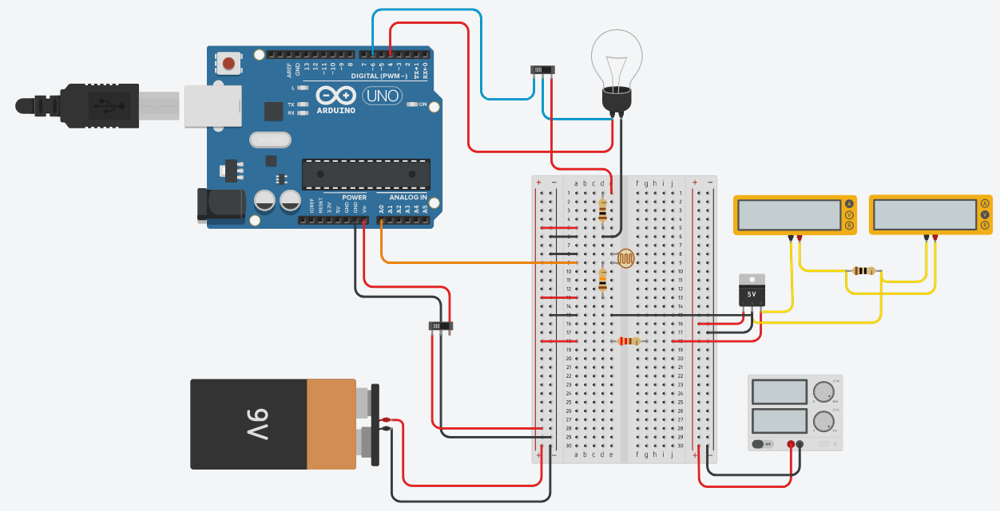

# Documentação de Projeto de Lâmpada Solar

## 1. Introdução

A implementação do projeto pode ser vista pela foto abaixo:




## 2. Objetivos

- Criar uma lâmpada autônoma que nao necessite de interação humana para operar.
- Obter energia para o funcionamento da lâmpada de maneira sustentável.
- Facilitar o cotidiano do usuário com tal automação.

## 3. Materiais utilizados

### Lista de Materiais
 * Regulador de Tensão LM7805 de 5V;
 * Arduíno UNO R3;
 * 2 interruptores;
 * 3 resistores: 2 de 10k Ohms e 1 de 220 Ohms;
 * 1 fotorresistor;
 * 1 Bateria de 9V;
 * 1 Minicélula fotovoltaica;
 * 1 lâmpada. 


## 4. Esquema Elétrico


O esquema elétrico pode ser visto por:


## 5. Código

```Cpp
#define lamp 4
#define ldr A0
int valor = 0;
int interruptor = 0;

void setup()
{
  Serial.begin(9600);
  pinMode(lamp, OUTPUT);
  pinMode(ldr, INPUT);
  pinMode(6,INPUT);
}

void loop()
{
  valor = analogRead(ldr);
  interruptor=digitalRead(6);
  if(valor > 350 && interruptor == LOW)
  {
  	digitalWrite(lamp,HIGH);
  }
  if(valor <= 350)
  {
  	digitalWrite(lamp,LOW);
  }
  Serial.println(valor);
}
```

## 6. Resultados

O vídeo de demonstração pode ser visto em: 


## 7. Desafios encontrados

- Realizar a conexão dos componentes de forma funcional e organizada.
